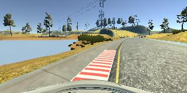
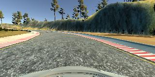
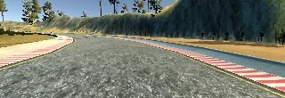

Behavioral Cloning
==================

The goals of this project was to design a pipeline that takes training images and steering angles to train a model that can successfully drive a car in a simulator around a track.

Model Architecture
==================

The model consists of two layers that normalize and crop the image, five convolutional layers and finally four fully connected layers.

The model is based off of the [Nvidia paper](https://images.nvidia.com/content/tegra/automotive/images/2016/solutions/pdf/end-to-end-dl-using-px.pdf)

The detail of the layers is as follows:

 - Lambda layer that normalized the image
 - Cropping layer that cropped the layer to the following. Take the pixels between the 70 and 25 pixels in the Y direction and all of them in the X direction.
 - Convolutional layer that produced 24 filter and used a 5x5 kernel with a stride of 2 in both directions.
 - Convolutional layer that produces 36 filters and used a 5x5 kernel with a stride of 2 in both directions.
 - Convolutional layer that produces 48 filters and used a 5x5 kernel with a stride of 2 in both directions.
 - Convolutional layer that produces 64 filters and used a 3x3 kernel.
 - Convolutional layer that produces 64 filters and used a 3x3 kernel.
 - A Flatten layer
 - Dense layer with 100 outputs.
 - Dense layer with 50 outputs.
 - Dense layer with 10 outputs.
 - Dense layer with 1 outputs.

All of the convolutional layers used `relu` for activation. There was no drop out, as there was no noticable evidence with the data set and this model of overfitting to the training set. This was tested in the models ability to get around a reasonable amount of the turns on track two, although some of the harder turns and more upright portions of the track proved difficult.

Training
========

The model was trained on image and steering angels that were collected throug manual control of the car in the simulator. There was an attempt to produce good data, but it turns out that I'm not the best at driving the car in the simulator. There were a couple of stages that went through with the training dataset and training the model itself.

The first step was to collect two laps worth of mostly center lane driving. After this was collected the model was trained with it and any issues were found. When a issue was found the run was stopped and the scenario was run through manually to collect recovery data. After the trouble areas were manually corrected the model was retrained with the new data.

The second step was to collect more data in unlikely, but useful scenarios. These consisted of purposefully driving towards the edge of the road and performing hard corrections. This helped to increase the ability for the car to drive mostly in the center lane and in some cases recover from bad driving.

Overall the model was trained for 10 epochs which seemed to produce a good validation loss. The training data used a 20% split for validation. There was no need to tune the learning rate as the optimize that was used was Adam.

Some example images:

Right side road recovery training image:

Middle of the road image:

These raw images were transformed into the following format within the model. The image was resized to be the following dimensions, 50 pixels tall by 320 pixels wide. The bottom 25 pixels were chopped off to remove the car from the image and the top 25 pixels were removed to ignore random portions of the image itself, specifically trees and other objects above the horizon.

Scaled image fed into the network:

There was no further processing on the images, the network operated on the full RGB image after it was normalized to have pixel values between 0 and 1.

Model Iterations
================

Although I ultimately ended up using the model described in the Nvidia paper there was some earlier attempts.

The first attempt was to try and use a couple Convulutional layers and a fairly wide dense layer for predicting the steering angels. What occured here was that the model overfit the training set and performed poorly on its own in the simulator. The overfitting was evidence by the training validation loss decreasing and the validation loss increasing.

After toying around with making the model wider and a little deeper that was when I switched over to the Nvidia model. At first I was having issues with it not performing well on it's own even though it was getting low validation loss values. 

The first attempt that fixing that was to add more convolutional layers as well as make the fully connected portion of the model deeper and wider. After having made this change the model performed much worse.

The second attempt was to move back to the model as described in the paper, but this time collected rouighly three times the amount of data as before. After recording another four laps on the first course and another two laps on the challenge course and training on the resulting much larger dataset I saw a great leap in performance.

This second attempt is where I am now and the model shows good ability to recover when close to the edge of the road and does a fairly good job at staying center lane.

Conclusion
==========

Overall the model performs well on the first track, but because of a lack of data on the second track the tight turns and elevation changes can and do confuse the model requiring manual intervention to prevent the car from steering off the track completely. As far as performance is concerned the network does not require a lot of processing power and I can see that it does perform in near real time, I'm not entirely sure how often the images are sent to the runner program over the websocket connection, but it seems to be tied to rendering speed which was quite fast. I think an interesting extension to the model and driving program would be to create a network that takes the three images and processes them all at once to produce the singular steering angel, rather than using the left and right images with modified steering angles for correction. This would give the model a nearly 180 degree view around the car and I believe the performance might be better and may generalize a little bit better.
